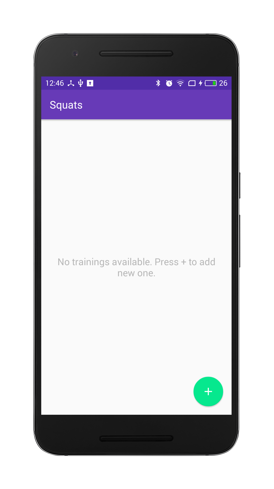
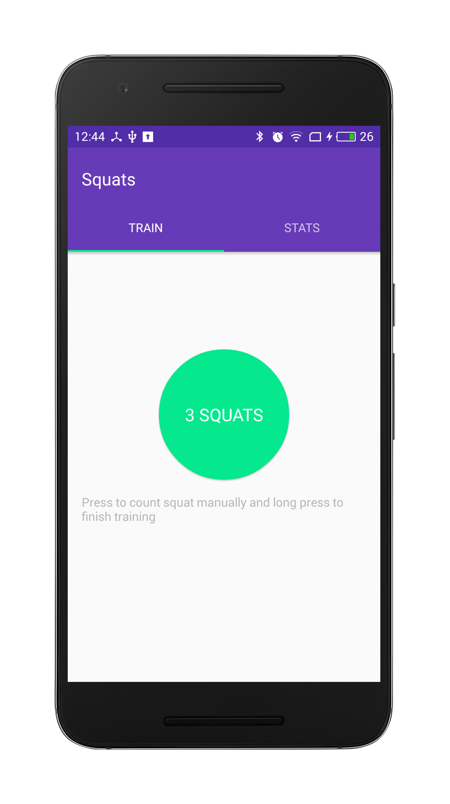
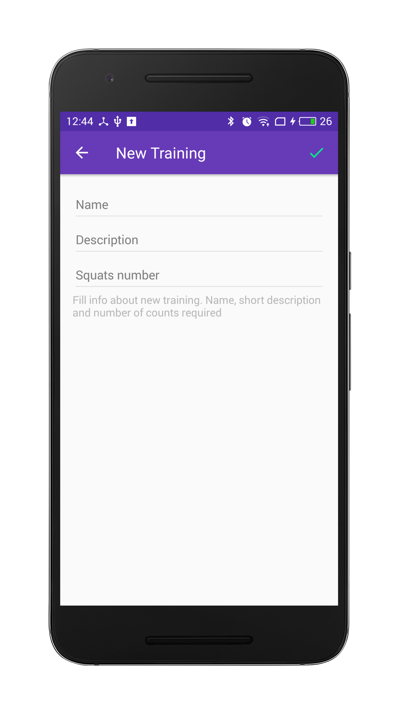
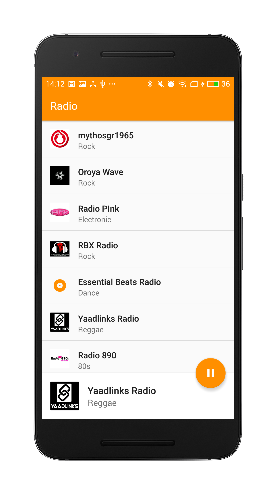
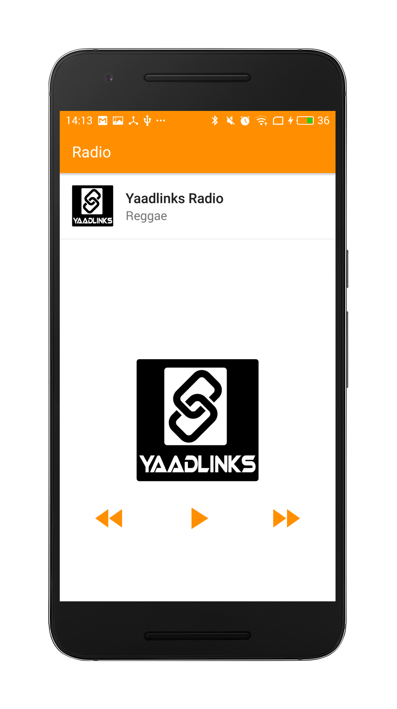
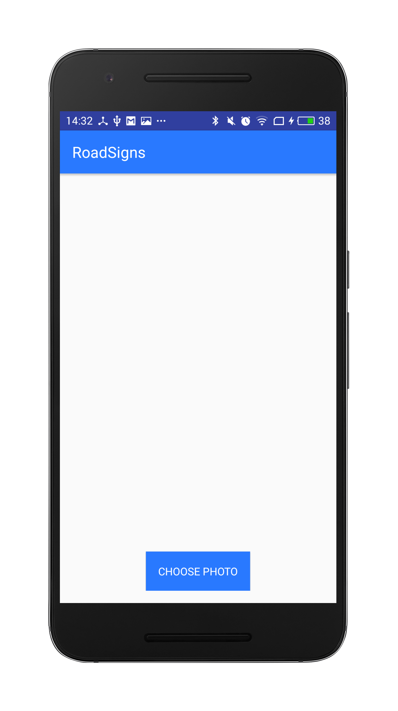
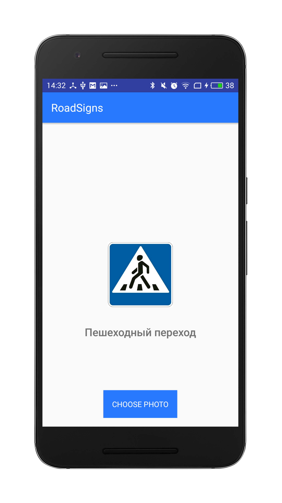

# YMC2016
My apps for **Yandex Mobile Contest 2016**. 

## Squats
Application which allows count squats done using Accelerometer sensor or manually by taping button.

What I used: 
* **RxJava/RxAndroid** to build in-app architecture, deal with sensor and backpressure.
* **Dagger2** to connect app parts
* **Butterknife** for simple viewbindings
* **Realm** to store trainings

#### Screenshots

## Radio
Application which allows to listen streaming internet radio from radio stations agregator Drible.com. It include radionstation list and simple mediaplayer implementation. Mediaplayer running in Service so you can listen to radio when app is hidden. Communications between service and UI layer are made using simple RxBus.

What I used: 
* **RxJava/RxAndroid** to build in-app architecture, deal with sensor and backpressure.
* **Dagger2** to connect app parts
* **Butterknife** for simple viewbindings
* **Retrofit** for comfy work with REST

#### Screenshots

## RoadSigns
Application provides image recognition for road signs. I used CraftAR Cloud recognition API, but free plans only allows upload 20 images as recognize models so actually app can recognize with 90% accuracy only 2 types of signs, other ones can be recognized in 20-40% cases. Build using MVP Clean Architecture design pattern.

What I used: 
* **Butterknife** for simple viewbindings
* **Retrofit** for comfy work with REST

#### Screenshots

